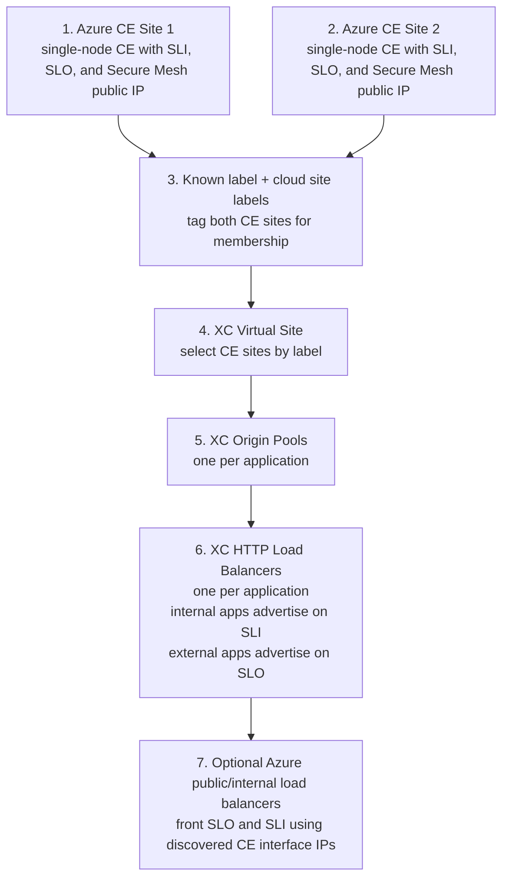

# Deployment diagram

This diagram shows the order in which the Terraform-managed F5 XC objects are composed, along with the interfaces present on each Azure Customer Edge (CE) site and the optional Azure frontends that can be placed in front of them.

## Interface roles

- **SLO / outside subnet**
  - client-facing side of the CE
  - used for external client traffic when the HTTP load balancer is advertised on the outside network
- **SLI / inside subnet**
  - backend-facing side of the CE
  - used by the origin pool to reach the private application
  - can also serve internal client traffic when the HTTP load balancer is advertised on the inside network
- **Secure Mesh public IP**
  - used for CE control-plane connectivity to F5 XC
  - this is management connectivity, not the private application path

## Notes

- This is a deployment/object diagram, not the live request path.
- The Virtual Site is a logical grouping of CE sites selected by label, not a separate traffic-processing hop.
- The application itself is not deployed by this repository; the origin is an external private IP or private DNS name supplied through `origin_server_value`.
- Each application gets its own XC Origin Pool and XC HTTP Load Balancer. Set `advertise_network` per app to `SITE_NETWORK_INSIDE`, `SITE_NETWORK_OUTSIDE`, or `SITE_NETWORK_INSIDE_AND_OUTSIDE`.
- When enabled, the Azure load balancer resources are created per CE site and attach to CE SLO/SLI backend IPs discovered from the site's Azure NICs and subnets. You can override those backend IP lists explicitly if auto-discovery is not sufficient.
- DNS for each application domain is expected to be managed outside this stack because the load balancer sets `dns_volterra_managed = false`.
