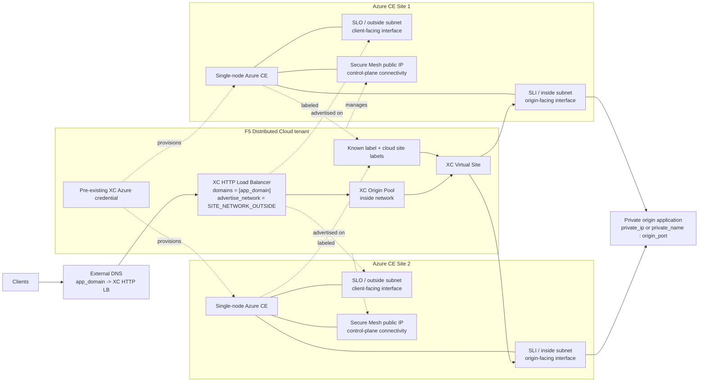

# Deployment diagram

This diagram shows the objects created by this Terraform stack and the interfaces used by each Azure Customer Edge (CE) site.

## Interface roles

- **SLO / outside subnet**
  - client-facing side of the CE
  - used to advertise the HTTP load balancer on `SITE_NETWORK_OUTSIDE`
- **SLI / inside subnet**
  - backend-facing side of the CE
  - used by the origin pool to reach the private application
- **Secure Mesh public IP**
  - used for CE control-plane connectivity to F5 XC
  - this is management connectivity, not the private application path

## Notes

- The application itself is not deployed by this repository; the origin is an external private IP or private DNS name supplied through `origin_server_value`.
- DNS for `app_domain` is expected to be managed outside this stack because the load balancer sets `dns_volterra_managed = false`.
