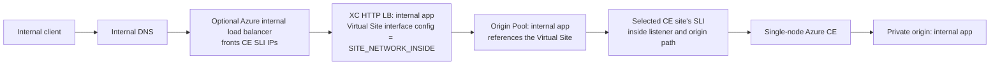

# Traffic flow diagrams

This page uses smaller diagrams instead of one large diagram so the Virtual Site is not mistaken for a packet-processing hop. Each application gets its own XC HTTP load balancer and origin pool. Internal applications advertise on `SLI`, external applications advertise on `SLO`, and dual-network applications can advertise on both.

## Virtual Site role

- The **XC Virtual Site** is a **logical grouping of labeled CE sites**.
- Origin pools and HTTP load balancers reference that grouping.
- The `SITE_NETWORK_*` setting is the **Virtual Site interface configuration** used by an application's HTTP load balancer advertisement.
- The Virtual Site is **not** a separate proxy, appliance, or forwarding hop.
- Traffic still lands on a selected **CE site**.

## External application example

```mermaid
flowchart LR
  extClient["External client"]
  extDns["External DNS"]
  publicLb["Optional Azure public load balancer<br/>fronts CE SLO IPs"]
  extApp["XC HTTP LB: external app<br/>Virtual Site interface config = SITE_NETWORK_OUTSIDE"]
  extPool["Origin Pool: external app<br/>references the Virtual Site"]
  ceSlo["Selected CE site's SLO<br/>outside listener"]
  ce["Single-node Azure CE"]
  ceSli["Selected CE site's SLI<br/>inside interface"]
  extOrigin["Private origin: external-facing app"]

  extClient --> extDns --> publicLb --> extApp --> extPool --> ceSlo --> ce --> ceSli --> extOrigin
```

## External application sequence

1. An external client resolves the application's public DNS record.
2. The client connects either directly to the advertised CE outside VIP or through the optional Azure public load balancer.
3. The external application's XC HTTP load balancer receives the request on `SLO`.
4. That application's origin pool targets the shared XC Virtual Site.
5. The Virtual Site acts as a logical selector for the labeled Azure CE sites rather than a separate traffic-processing hop.
6. The CE forwards the request out its `SLI` inside interface to the application's private origin.

## Internal application example

## Internal application sequence

1. An internal client resolves the application's internal DNS record.
2. The client connects either directly to the advertised CE inside VIP or through the optional Azure internal load balancer.
3. The internal application's XC HTTP load balancer receives the request on `SLI`.
4. That application's origin pool targets the shared XC Virtual Site.
5. The Virtual Site acts as a logical selector for the labeled Azure CE sites rather than a separate traffic-processing hop.
6. The CE forwards the request to the application's private origin on the inside network.

## Shared application note

- A shared application uses `SITE_NETWORK_INSIDE_AND_OUTSIDE` as the Virtual Site interface configuration for that app's HTTP load balancer.
- Clients can enter through either the external `SLO` path or the internal `SLI` path.
- The backend is still a **private origin reached over `SLI`**.

## Notes

- This diagram represents request traffic, not Terraform resource creation order.
- The repository does not deploy the application workloads; it only points each application to a private backend defined in `applications`.
- External traffic can still target a private/internal application backend; the listener side changes by app, but origin traffic still goes to private backends over `SLI`.
- The XC Virtual Site is a logical grouping of CE sites selected by label. It is referenced by origin pools and HTTP load balancers, but it is not a separate packet-processing box.
- Management connectivity over the Secure Mesh public IP is intentionally omitted here because it is not in the application data path.
- Azure public and internal load balancers are optional resources in this Terraform. When enabled, the public LB creates one rule per external application port and the internal LB creates one rule per internal application port.
- Backend CE IPs are auto-discovered from Azure NICs by subnet membership when possible. If your deployment uses nonstandard addressing or multiple matching NICs, set the explicit backend IP override lists in `ce_sites`.
