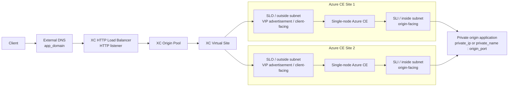

# Traffic flow diagram

This diagram shows the request path after the Terraform resources have been deployed.

## Traffic sequence

1. A client resolves `app_domain` using external DNS.
2. The client connects to the XC HTTP load balancer listener.
3. The load balancer selects the configured XC origin pool.
4. The origin pool targets the XC Virtual Site.
5. The Virtual Site selects one of the labeled Azure CE sites.
6. Traffic is advertised toward the selected CE site's `SLO` outside interface.
7. The CE forwards the request out its `SLI` inside interface.
8. The private origin application receives the request on `origin_port`.

## Notes

- This diagram represents request traffic, not Terraform resource creation order.
- The repository does not deploy the origin application; it only points to the private backend defined by `origin_server_type` and `origin_server_value`.
- Management connectivity over the Secure Mesh public IP is intentionally omitted here because it is not in the application data path.
