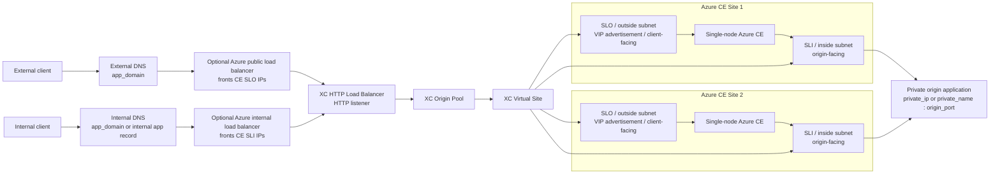

# Traffic flow diagram

This diagram shows the request paths after the Terraform resources have been deployed. In the default configuration, the same HTTP load balancer is advertised on both the CE inside and outside networks. Optional Azure public and internal load balancers can front those CE interfaces.

## External traffic sequence

1. An external client resolves `app_domain` using external DNS.
2. The external client connects either directly to the advertised CE outside VIP or through the optional Azure public load balancer.
3. The load balancer selects the configured XC origin pool.
4. The origin pool targets the XC Virtual Site.
5. The Virtual Site selects one of the labeled Azure CE sites.
6. Traffic is advertised toward the selected CE site's `SLO` outside interface.
7. The CE forwards the request out its `SLI` inside interface.
8. The private origin application receives the request on `origin_port`.

## Internal traffic sequence

1. An internal client resolves the application name using internal DNS.
2. The internal client connects either directly to the advertised CE inside VIP or through the optional Azure internal load balancer.
3. The load balancer selects the configured XC origin pool.
4. The origin pool targets the XC Virtual Site.
5. The Virtual Site selects one of the labeled Azure CE sites.
6. Traffic is advertised toward the selected CE site's `SLI` inside interface.
7. The CE forwards the request to the private origin application on `origin_port`.

## Notes

- This diagram represents request traffic, not Terraform resource creation order.
- The repository does not deploy the origin application; it only points to the private backend defined by `origin_server_type` and `origin_server_value`.
- Management connectivity over the Secure Mesh public IP is intentionally omitted here because it is not in the application data path.
- Azure public and internal load balancers are optional resources in this Terraform. When enabled, the public LB backs onto the CE `SLO` addresses and the internal LB backs onto the CE `SLI` addresses.
- Backend CE IPs are auto-discovered from Azure NICs by subnet membership when possible. If your deployment uses nonstandard addressing or multiple matching NICs, set the explicit backend IP override lists in `ce_sites`.
